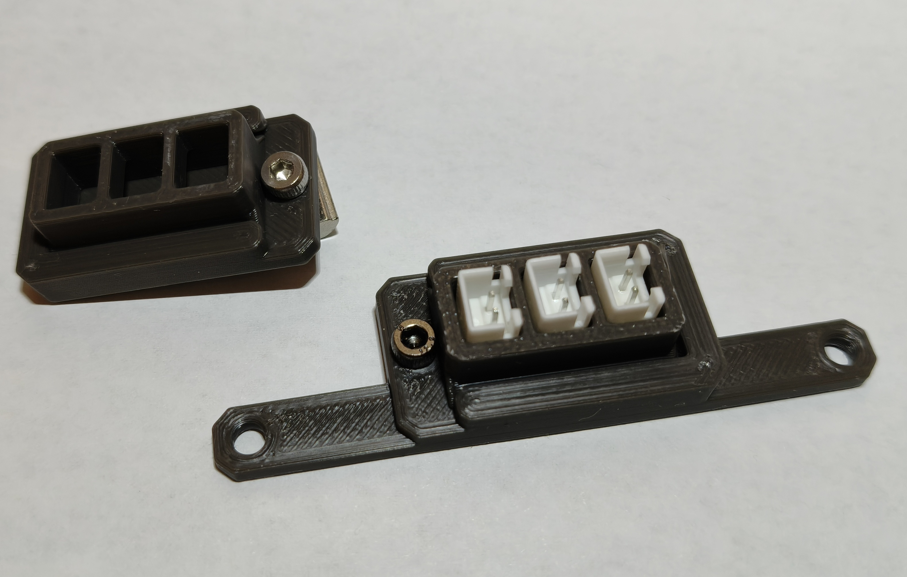
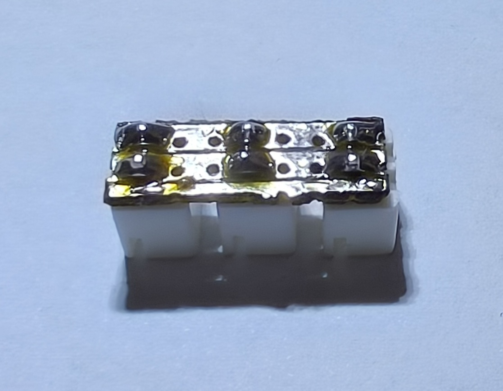
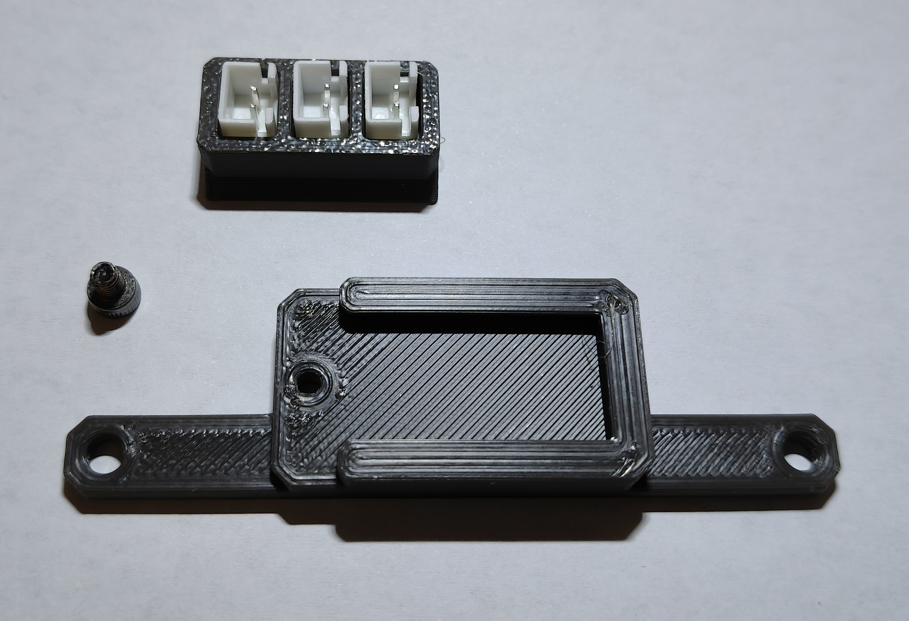
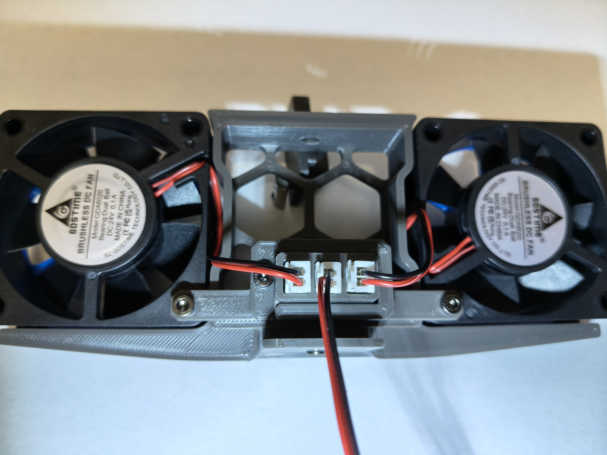

# Fan Hub for JST-XH fan connectors.

This is a fan hub that provides 3xJST-XT 2-pin connectors that allows for 2 fans and the lead-in cable to be connected to it.

There are 2 options provided, one mounts to the Voron fans (with heatset inserts added to the fan holes) and the other can mount to an extrusion or any other place a bolt or screw can be used.

The electronics doesn't require a manufactured PCB, it uses a small piece of Stripboard/Veroboard to mount the JST-XH sockets. Any prototype board with 2.54mm (1/10th inch) pin spacing can be used, however using the Veroboard means that you don't need wires to create the circuit. All connectors are mounted on the board facing in the same direction, so that they are electrically a parallel connection.

You need a grid of 7x2 holes. The board can be cut to size by scoring with a box cutter along a line that is aligned with the holes, and then bending to snap it. You might need pliers to help bend it. Once you have mounted the connectors as shown, trim any excess board material protruding past the connectors.

Once the circuit is made, it slides into the Holder from underneath. The circuit is a loose fit, to allow room for different construction options, but it won't go anywhere. The Holder then slides into the base where it is retained with a short M3x4 SHCS bolt. The alternative mount uses a single bolt to both mount the base and retain the Holder.

The following picture shows it installed on the Voron fan assmembly. My Voron Trident has the inverted electronics mod, so I have it mounted close to the panel retention clip. However if you have the electronics in the standard configuration you can mount the base up top instead. You need to install an M3 heatset insert into the fans, like you do on the other side of the fans to mount them.

## BOM

- 3 x JST-XH socket
- 1 x Stripboard/Veroboard or other prototyping board cut to size
- 1 x M3x4 SHCS bolt (for Voron mount)
- 3 x M3x8 SHCS bolts (2 for Voron mount)
- 2 x M3X4X5 heatset inserts (for Voron mount)

## Printing

These should be printed as they appear in the STL file. The Holder prints upside down with a small overhang, the other parts print right side up.
