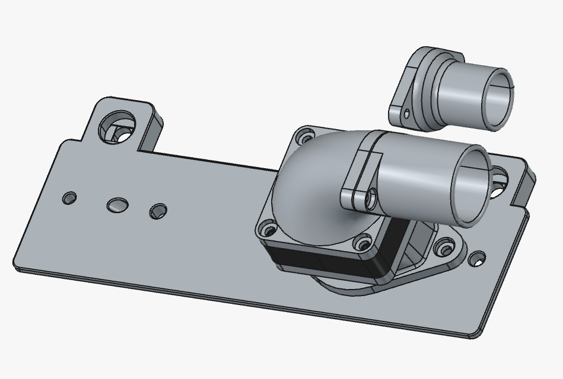
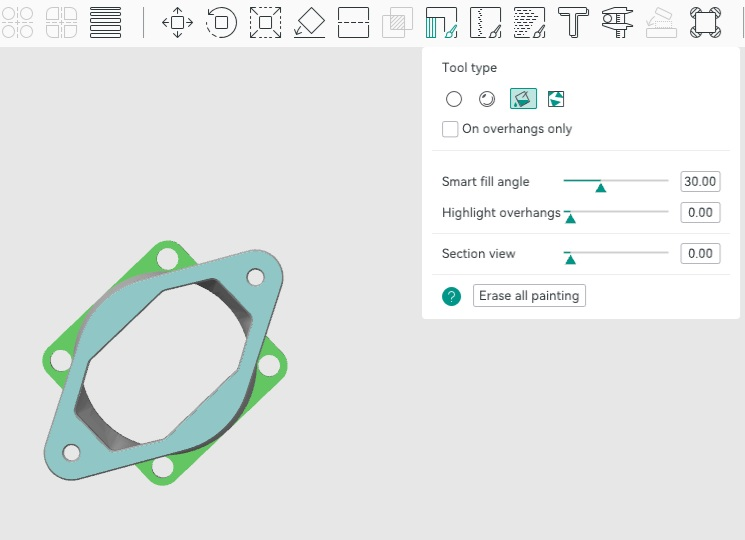
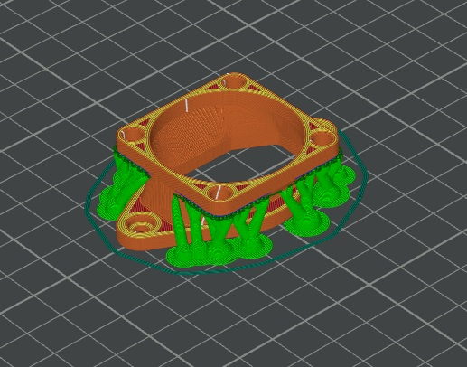
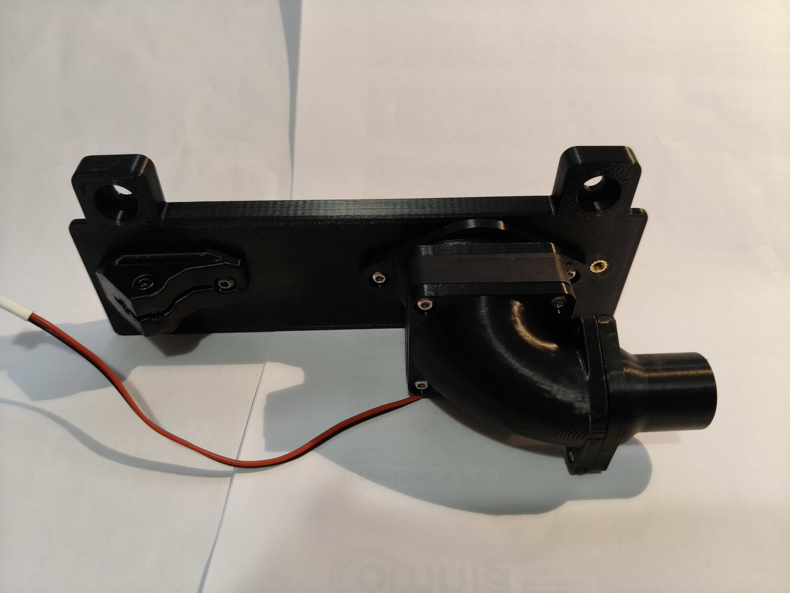
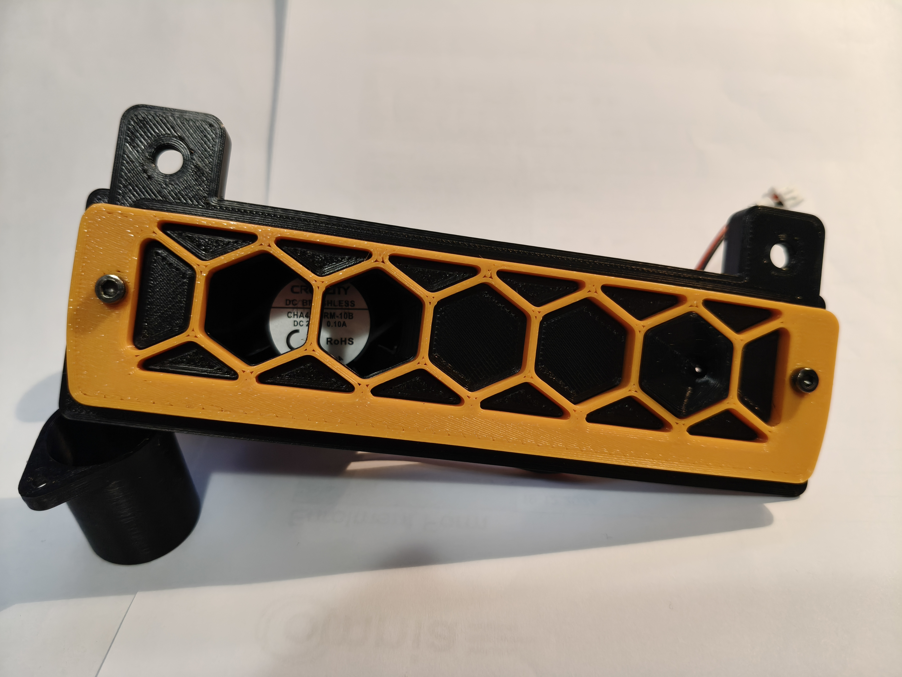

# Voron Trident R2 Fume Extraction

## Saying farewell to the Trident R1 exhaust fan

The R2 release of the Trident removed the exhaust fan for fume extraction.
I think this is a good step, as the existing fan box fell short of doing
anything useful - no hose attachment, no filter, large fan sucks all heat
out of the chamber when on, lets fumes leak when off.

## A new take on fume extraction

I have seen a number of fume extraction designs that re-use 100mm tubes
used by A/C plumbing, usually driven by large fans. While this may be
effective at removing fumes quickly, it also removes heat from the chamber
quickly and doesn't lend itself to printing anything other than PLA.

With the sealed chamber I hardly smell anything while printing ABS. So I
wondered if I had a small amount of exhaust flow, just enough to create a
negative pressure differential inside the chamber, would that stop the
remaining fumes from leaking out while printing.

The idea of a negative pressure differential is to cause any small gaps to
only flow air from outside of the chamber in. That one-way flow fights
against any fumes trying to escape.

With only a small flow, the heat inside the chamber shouldn't be impacted
by much, and printing ABS, ASA, etc should still be possible.

When the print finishes, there is a long wait for everything to cool down
before removing the finished print. Even with a small air flow, by the
time the door is opened all the fumes should be gone.

## Introducing the Trident R2 exhaust fan mod

The exhaust fan mod uses a 4010 axial fan (a good use for Stealthburner parts)
to exhaust fumes through the small rear panel into a small tube (19mm, 22mm
and 25mm adapters provided) that can be easily routed out of a window or
some other vent.

### BOM

1. 4010 axial fan (24V or whatever your control board can drive)
2. 6 x M3x5x4 heatset inserts (standard Voron ones)
3. 4 x M3x6 BHCS or SHCS (BHCS installs flush but SHCS works)
4. 4 x M3x16 BHCS or SHCS (BHCS installs flush but SHCS works)

## Printing Information

The ExhaustToFanAdapter requires painted on supports to print. Everything
else prints without supports. You don't need any shrinkage compensation
when printing with ABS, there is enough tolerance in the holes.

To paint on supports, enable supports and select the "Tree (manual)" type.
Flip the object upside down, select it and click on the support painter
toolbar icon. Use the fill operation and click beside each of the 4 holes.

Click on the support painter toolbar icon again to complete. Slice the
build plate and it should look like the following. If you made a mistake,
erase all painting and try re-painting the corners again.

## Assembly

1. Install 2 heatset inserts in the rear of the ExhaustCoverR2 part.
2. Install 4 heatset inserts in the top 4 holes of the ExhaustToFanAdapter.
3. Screw the ExhaustToFanAdapter to the ExhaustCoverR2 with 2 x M3x6 screws.
4. Screw the FanToHoseAdapter to the ExhaustToFanAdapter, sandwiching the
   4010 axial fan between them, with 4 x M3x16 scres.
5. Screw the desired HoseAdapter to the FanToHoseAdapter using 2 x M3x6 screws.
   Be gentle as these only screw into plastic.

Here are some photos of the printed and assembled fume extractor.

