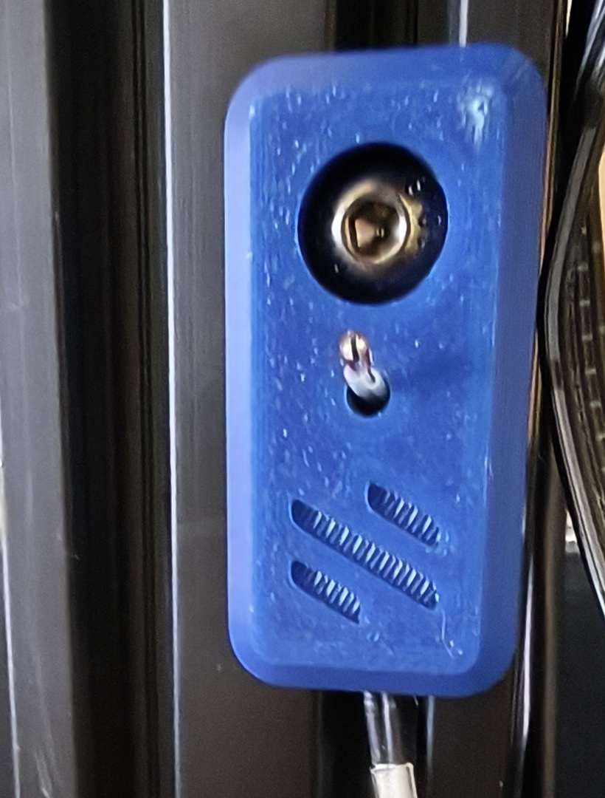

# Thermistor mount for 20-profile Extrusions

This is a simple mount to use a cheap glass bead termistor to measure chamber termerature.

The are versions with the Voron logo (both vertical and horizontal depending on where you want to
mount it) and a no-logo version. The STEP files are provided so you can add your own custom logo
starting with the no-logo STEP file.

# Printing

They will print with no supports in the orientation that the STL files load. Since they are not
load bearing you could use pretty much any profile (Voron profile suggested). Just don't tighten
the mounting screw too hard if you cheap out on the strength slicer settings.

# Assembly

Couldn't be easier. Poke the glass bead end through the side tunnel and guide it through the
bend so that the bead pops out the top. Let it stand proud a 3-5 mm, and bend will resist it
being pulled out, but it is still easy to disassemble.

Use an M5x10 BHCS and an M5 T-nut to mount to an 20-profile extrusion. Run the thermistor
wire done the extrusion and into the electronics bay. Plug into a spare thermistor port.
